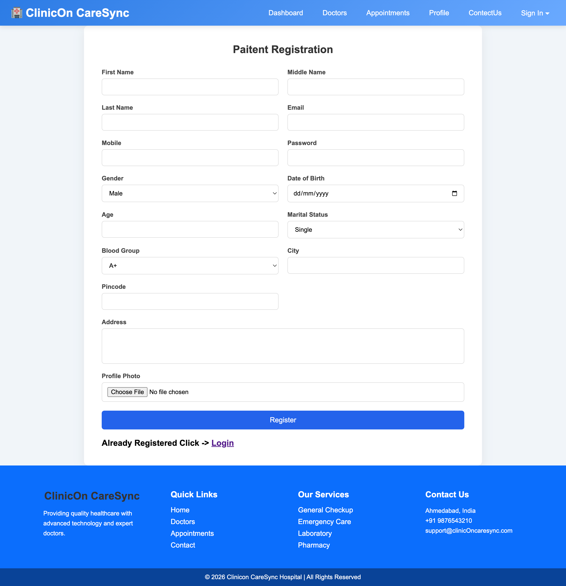
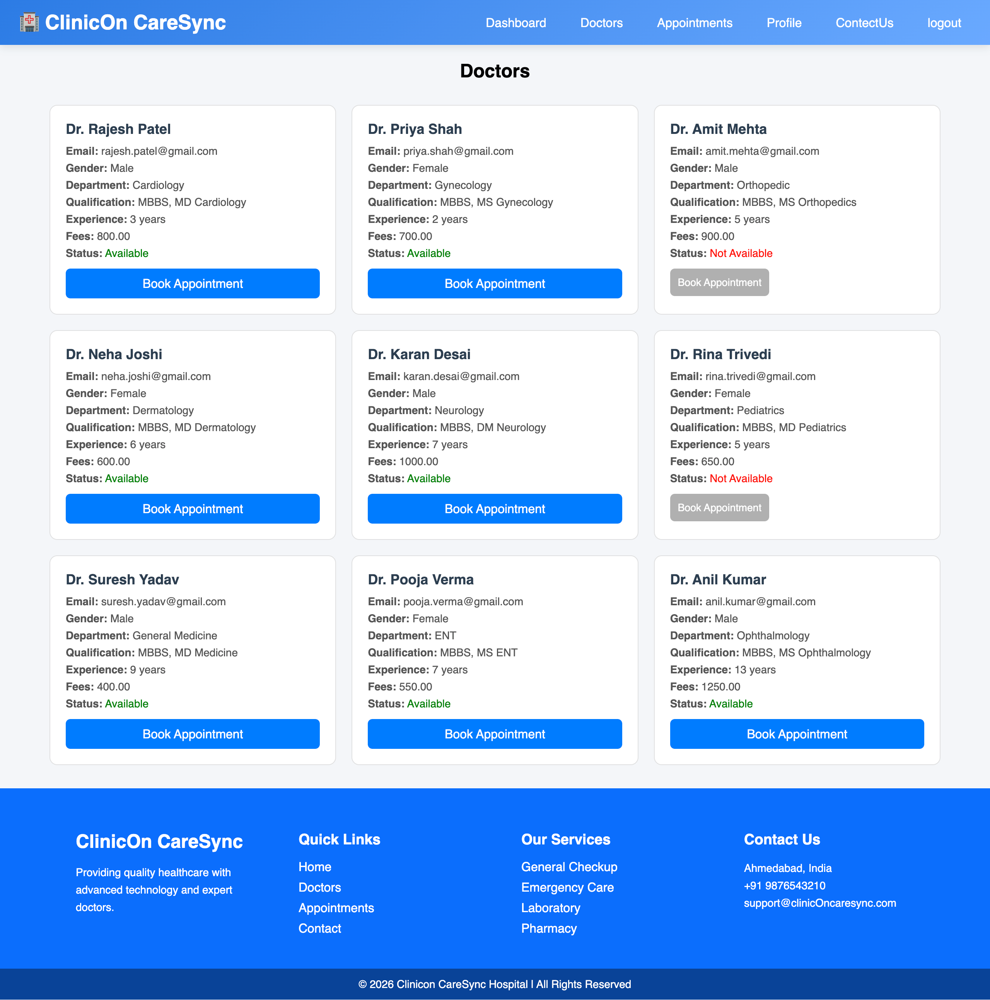

# Hospital Management System

A comprehensive Django-based hospital management system that allows patients to book appointments with doctors, manage payments, and handle prescriptions. The system includes three user roles: Patients, Doctors, and Managers (Admin).

## Features

### Patient Features
- User registration with OTP verification
- Login with email and password
- View available doctors
- Book appointments (today or tomorrow)
- Payment integration (Razorpay and Cash)
- Upload medical reports
- View appointment history
- Cancel appointments
- View prescriptions
- Profile management
- Contact form

### Doctor Features
- Doctor login
- View appointments
- Update appointment status (Approved/Rejected/Completed)
- View today's appointments
- View patient reports
- Send prescriptions to patients
- Profile management

### Manager (Admin) Features
- Manager registration and login
- Add/Update/Delete doctors
- View all registered users
- View all appointments
- Manage payments
- View contact messages
- Dashboard with revenue statistics

## Technology Stack

- **Backend**: Django 6.0.4
- **Database**: SQLite
- **Payment Gateway**: Razorpay
- **Image Processing**: Pillow
- **Python**: 3.14+

## Installation

1. Clone the repository:
```bash
git clone <repository-url>
cd finalyear_project_mca
```

2. Create a virtual environment:
```bash
python3 -m venv .venv
source .venv/bin/activate  # On Windows: .venv\Scripts\activate
```

3. Install dependencies:
```bash
pip install -r requirements.txt
```

4. Run migrations:
```bash
python manage.py migrate
```

5. Create a superuser (optional):
```bash
python manage.py createsuperuser
```

6. Run the development server:
```bash
python manage.py runserver
```

7. Open your browser and navigate to:
```
http://127.0.0.1:8000/
```

## Configuration

### Email Settings
Update the following settings in `finalyear_project_mca/settings.py`:
```python
EMAIL_BACKEND = 'django.core.mail.backends.smtp.EmailBackend'
EMAIL_HOST = 'smtp.gmail.com'
EMAIL_PORT = 587
EMAIL_USE_TLS = True
EMAIL_HOST_USER = 'your-email@gmail.com'
EMAIL_HOST_PASSWORD = 'your-app-password'
```

### Razorpay Settings
Update the Razorpay credentials in `finalyear_project_mca/settings.py`:
```python
RAZORPAY_KEY_ID = "your-key-id"
RAZORPAY_KEY_SECRET = "your-key-secret"
```

## Project Structure

```
finalyear_project_mca/
├── app1/                          # Main application
│   ├── migrations/                # Database migrations
│   ├── static/                    # Static files
│   │   └── CSS/                   # Stylesheets
│   │       ├── patient/          # Patient-specific CSS
│   │       ├── doctor/           # Doctor-specific CSS
│   │       └── manager/          # Manager-specific CSS
│   ├── templates/                 # HTML templates
│   │   ├── patient/              # Patient templates
│   │   ├── doctor/               # Doctor templates
│   │   └── manager/              # Manager templates
│   ├── admin.py                  # Admin configuration
│   ├── models.py                 # Database models
│   ├── urls.py                   # URL routing
│   └── views.py                  # View functions
├── finalyear_project_mca/         # Project configuration
│   ├── settings.py               # Django settings
│   ├── urls.py                   # Main URL configuration
│   └── wsgi.py                   # WSGI configuration
├── manage.py                     # Django management script
├── requirements.txt              # Python dependencies
├── .gitignore                    # Git ignore rules
└── README.md                     # This file
```

## Static and Media Files

### Static Files
Static files (CSS, JavaScript, images) are located in `app1/static/`:
- **CSS files**: Organized by user role (patient, doctor, manager)
- **Static URL**: `/static/`

### Media Files (User Uploads)
User-uploaded content (photos, reports, prescriptions) are stored in the media folder:
- **Media URL**: `/media/`
- **Media Root**: `BASE_DIR/media/`
- **Content types**:
  - Patient profile photos
  - Medical reports (PDF, images)
  - Prescription documents

**Note**: The `media/` folder will be automatically created when users upload files. Ensure the directory has write permissions.

## Screenshots

### Patient Interface






### Doctor Interface
<!-- Add doctor login screenshot -->
<!-- Add doctor dashboard screenshot -->
<!-- Add appointments list screenshot -->
<!-- Add prescription form screenshot -->

### Manager (Admin) Interface
<!-- Add manager login screenshot -->
<!-- Add manager dashboard screenshot -->
<!-- Add doctor management screenshot -->
<!-- Add users list screenshot -->
<!-- Add payments management screenshot -->

## Database Models

- **registration**: Patient information
- **doctor**: Doctor profiles and availability
- **appointment**: Appointment bookings
- **Payment**: Payment records
- **PatientReport**: Patient medical reports
- **PrescriptionReport**: Doctor prescriptions
- **Manager**: Admin users
- **contactmessage**: Contact form submissions

## Usage

### Patient Flow
1. Register as a patient
2. Login with email and password (OTP verification required)
3. Browse available doctors
4. Book an appointment
5. Make payment (Razorpay or Cash)
6. View appointments and prescriptions

### Doctor Flow
1. Login as a doctor
2. View upcoming appointments
3. Update appointment status
4. View patient reports
5. Send prescriptions

### Manager Flow
1. Login as manager
2. Manage doctors (add/update/delete)
3. View all users and appointments
4. Manage payments
5. View contact messages

## Security Notes

- This project uses Django's built-in security features
- Passwords are hashed using Django's password hasher
- CSRF protection is enabled
- Session-based authentication
- **Important**: Update SECRET_KEY in settings.py before production deployment
- **Important**: Use environment variables for sensitive credentials in production

## License

This project is for educational purposes.

## Contributing

Contributions are welcome. Please follow these steps:
1. Fork the repository
2. Create a feature branch
3. Commit your changes
4. Push to the branch
5. Create a Pull Request
